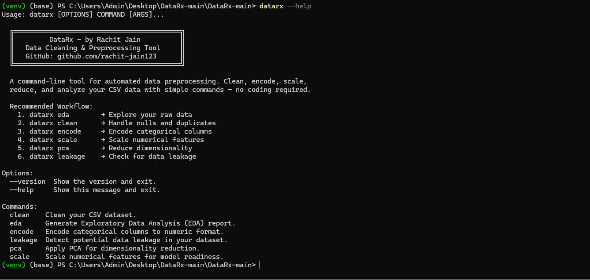
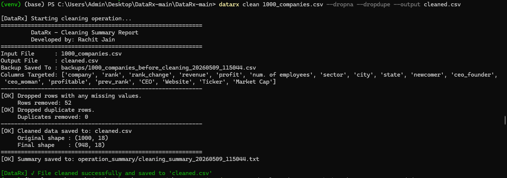
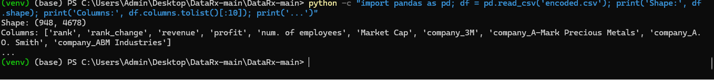
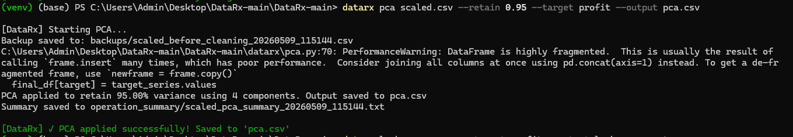

# 🧬 DataRx
### A Command-Line Tool for Data Cleaning and Preprocessing


---

## 📌 Overview

**DataRx** is a lightweight yet powerful command-line tool built for end-to-end data preprocessing of CSV datasets. Just like a prescription (Rx) treats a patient, DataRx treats your raw, messy data — making it clean, structured, and model-ready.

No more writing the same pandas boilerplate every time. Just run a command and move on to what matters: **insights, modelling, and impact.**

---

## 🎯 Who is this for?

- 🎓 Students and researchers building reproducible ML pipelines
- 📊 Data analysts working with CSV datasets
- 🤖 ML engineers preparing training data
- ⚡ Hackathon participants who need fast preprocessing

---

## ✨ Features

| Feature | Description |
|--------|-------------|
| 🧹 **Data Cleaning** | Handle missing values, remove duplicates |
| 🔢 **Encoding** | Label encoding and One-Hot encoding |
| 📏 **Scaling** | Standard, MinMax, and Robust scaling |
| 📉 **PCA** | Dimensionality reduction with variance control |
| 🔍 **Leakage Detection** | Identify target leakage via correlation |
| 📊 **EDA** | Auto-generate visual reports and summaries |
| 💾 **Backup System** | Automatic backup before every transformation |
| ⚠️ **Smart Conflict Detection** | Prevents conflicting flag combinations |

---

## 🛠️ Installation

### Install via pip
```bash
pip install datarx
```

### Install from Source
```bash
git clone https://github.com/rachit-jain123/DataRx
cd DataRx
pip install .
```

### Recommended: Use a Virtual Environment
```bash
python -m venv venv
venv\Scripts\activate        # Windows
source venv/bin/activate     # Mac/Linux
pip install datarx
```

---

## 🚀 Quick Start

```bash
# Step 1: Explore your data first
datarx eda yourdata.csv --target targetcolumn --output eda_report.txt

# Step 2: Clean missing values and duplicates
datarx clean yourdata.csv --dropna --dropdupe --output cleaned.csv

# Step 3: Encode categorical columns
datarx encode cleaned.csv --method onehot --output encoded.csv

# Step 4: Scale numerical features
datarx scale encoded.csv --method standard --output scaled.csv

# Step 5: Apply PCA (retain 95% variance)
datarx pca scaled.csv --retain 0.95 --target targetcolumn --output pca.csv

# Step 6: Check for data leakage
datarx leakage pca.csv --target targetcolumn --output leakage_report.csv
```

---

## 📋 Available Commands

| Command | Purpose |
|---------|---------|
| `clean` | Handle missing values and duplicates |
| `encode` | Encode categorical columns |
| `scale` | Normalize or standardize numerical features |
| `pca` | Apply dimensionality reduction |
| `leakage` | Identify potential data leakage |
| `eda` | Generate visual EDA reports |

```bash
# Get help for any command
datarx <command> --help
```

---

## 📖 Detailed Command Reference

### 🧹 clean
```bash
datarx clean input.csv --dropna --dropdupe --output cleaned.csv
datarx clean input.csv --fillna mean --output cleaned.csv
```
Options: `--dropna`, `--fillna [mean/median/mode/constant]`, `--dropdupe`

---

### 🔢 encode
```bash
datarx encode cleaned.csv --method onehot --output encoded.csv
datarx encode cleaned.csv --method label --columns col1 col2 --output encoded.csv
```
Options: `--method [label/onehot]`, `--columns`

---

### 📏 scale
```bash
datarx scale encoded.csv --method standard --output scaled.csv
datarx scale encoded.csv --method minmax --columns col1 col2 --output scaled.csv
```
Options: `--method [standard/minmax]`, `--columns`

---

### 📉 pca
```bash
datarx pca scaled.csv --retain 0.95 --target profit --output pca.csv
datarx pca scaled.csv --components 5 --target profit --output pca.csv
```
Options: `--retain [0.0-1.0]`, `--components [int]`, `--target`

---

### 🔍 leakage
```bash
datarx leakage pca.csv --target profit --threshold 0.85 --output leakage_report.csv
```
Options: `--target`, `--threshold [default: 0.85]`

---

### 📊 eda
```bash
datarx eda data.csv --target profit --output eda_report.txt
datarx eda data.csv --target profit --output eda_report.txt --skip_graphs
```
Options: `--output`, `--target`, `--skip_graphs`

---

## 🔄 Recommended Workflow

```
Raw CSV
   │
   ▼
[ EDA ]  ──────────────────► eda_report/ (graphs + summary)
   │
   ▼
[ CLEAN ]  ─────────────────► cleaned.csv
   │
   ▼
[ ENCODE ]  ────────────────► encoded.csv
   │
   ▼
[ SCALE ]  ─────────────────► scaled.csv
   │
   ▼
[ PCA ]  ───────────────────► pca.csv
   │
   ▼
[ LEAKAGE ]  ───────────────► leakage_report.csv
   │
   ▼
Model-Ready Data
```

---

## 📸 Screenshots

### Help Menu


### Clean Output


### Encode Output


### Scale Output


### PCA Output


### Leakage Report


### EDA Graphs


---

## 🗺️ Roadmap

- [x] CLI Framework (Click)
- [x] Clean, Encode, Scale, PCA modules
- [x] Data Leakage Detection
- [x] EDA with graphs and smart recommendations
- [x] Auto column detection and safety checks
- [ ] One-Click PDF Report Generator
- [ ] Built-in Train-Test Split Utility
- [ ] Support for `.xlsx` and `.json` formats
- [ ] Streamlit GUI (lightweight web interface)
- [ ] Model-Based Feature Suggestions

---

## 🤝 Contributing

Contributions are welcome!

1. Fork the repository
2. Create a new branch: `git checkout -b feature-name`
3. Make your changes (follow PEP8)
4. Submit a Pull Request

Please open an issue first for major feature additions.

---

## ❓ FAQ

**Q: Do I need Python knowledge to use DataRx?**  
A: No. It is a CLI tool — just run commands in your terminal.

**Q: Which file formats are supported?**  
A: Currently `.csv` only. Excel and JSON support coming soon.

**Q: Does it modify my original file?**  
A: Never. DataRx always creates new output files and backs up inputs.

**Q: Can I automate the full pipeline?**  
A: Yes! Chain commands or write a shell script for full automation.

**Q: What if I pass conflicting flags?**  
A: DataRx detects conflicts like --dropna and --fillna together and shows a clear error.

---

## 📄 License

MIT License — Copyright (c) 2025 Rachit Jain
See LICENSE for full details.
---

## 📬 Contact

**Rachit Jain**  
📧 jrachit683@gmail.com  
🔗 [GitHub](https://github.com/rachit-jain123) | [LinkedIn](https://linkedin.com/in/rachit-jain123)

---

> *"Let DataRx handle the groundwork, so you can focus on what really matters — insights, impact, and innovation."*
